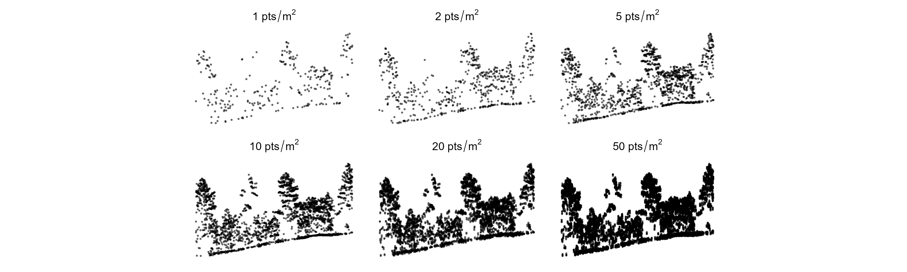

  
  <!-- README.md is generated from README.Rmd. Please edit that file -->
  
```{r, echo = FALSE, warning=FALSE, message=FALSE}
options(digits = 2)

knitr::opts_chunk$set(
  collapse = TRUE,
  fig.path = "graphics/",
  fig.width = 7,
  fig.height = 5,
  comment = "#>",
  dev = "svg",
  dpi = 300
)

# library(tidyverse)
# library(sf)
# library(rnaturalearth)
# library(tidyterra)
# library(patchwork)
# library(tmap)

```
  
# LidarSpeedTests
This repository is dedicated to evaluating the performance of various point cloud processing tools in handling typical airborne laser scanning (ALS) data processing tasks. The goal is to provide users with comparative insights into processing time, CPU, RAM, and disk usage across different tools and configurations. More importantly, benchmark results could help decide which processing parameters are most optimal given the dataset and workstation characteristics. 


## Project Overview

Point cloud processing tools offer a range of functionalities, often with overlapping capabilities. Users face decisions about which tool to use and how to configure settings for optimal performance. This project benchmarks several tools to guide these decisions.

## Benchmarking Methodology

- **Uniform Task Performance**: Each tool is tested against standardized tasks to ensure comparable results.
- **Resource Utilization**: We measure and record processing time, CPU and RAM usage. 
- **Iterative Testing**: Tools are tested under various conditions to assess performance impacts:
  - Different numbers of workers (CPU cores/threads)
  - Various storage devices including local (SSD, HDD) and network drives
  - Diverse input data characteristics

## Input Data

The benchmark uses a subset of ALS data acquired over the Peatawawa research forest located in in Ontario, Canada. The dataset is divided into 1 x 1 km tiles (100 tiles in total). This dataset is freely available and can be downloaded from https://opendata.nfis.org/mapserver/PRF.html.


The average point density of the dataset is 13.6 pts/m². To facilitate a comprehensive analysis, the original dataset was systematically reduced to create variants with different densities: 1, 2, 5, 10. To simulate dataset with higher point density, the data was artificially densified by duplicating and then introducing a random noise to a subset of points. This procedure was used to generate datasets with densities of 20, and 50 pts/m². Benchmarks were conducted across these modified datasets to assess performance at varying point densities.




## Included Software Packages

So far the benchmark focuses on lidar processing tools available in R (`lidR`, `lasR`), as well as `lastools`.

- `lidR`: https://github.com/r-lidar/lidR 
- `lasR`: https://github.com/r-lidar/lasR
- `lastools`: https://rapidlasso.de/product-overview/

## Benchmark Tasks

Tasks are categorized into 'Simple' and 'Complex' to differentiate between single-step operations and multi-step processing pipelines, respectively.

### Simple Tasks
- Ground classification
- Digital Terrain Model (DTM) generation
- Height normalization
- Point cloud metrics calculation (two scenarios: single metric, multiple metrics)
- ...

### Complex Tasks
- a workflow consisting of the following tasks: Generate DTM, normalize heights, and calculate metrics.
- ...

# Results

in progress

### Generate DEM


### Genenerate DSM 


### Normalization 


### Pixel metrics

#### Single metric


#### Multiple metrics


### Detecting treetops

